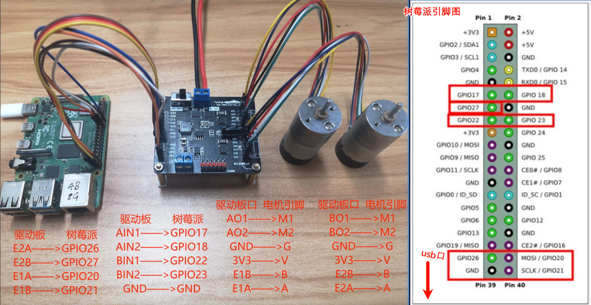
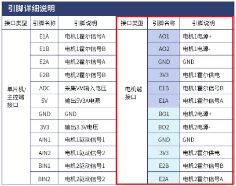

# 四驱车教程

1. [学前知识](#学前知识)
   - 树莓派
   - 直流有刷电机
   - 霍尔编码器
   - 双路电机驱动板

2. [代码解释](#代码解释)
   - 设置引脚编码
   - 定义电机引脚
   - 配置引脚
   - 电机控制函数
   - 设置编码器引脚
   - 事件检测机制（中断）

3. [配置原因解释](#配置原因解释)
   - 为什么要配置 GPIO 引脚？
   - 为什么使用 PWM 控制电机？
   - 为什么使用电机驱动板？
   - 为什么使用霍尔编码器？
   - 为什么要使用事件检测（中断）？


## 1.学前知识
1. **树莓派**：树莓派树莓派是一款高级的微型计算机，可以烧录像windows一样的图像界面系统，也可以像单片机一样直接控制IO口。
2. **直流有刷电机**：是最常见的电机，转速高低由电压控制。具有两个端口，改变电压输入方向，即可完成电机换向。
3. **霍尔编码器**：霍尔元件制作，专门用于记录轮子转的圈数之类的信息，用以计算速度。
4. **双路电机驱动板**：树莓派的IO口不能流过太大的电流，因此驱动电机的电流还需要驱动板提供。这块驱动板能驱动两个电机

<sub>树莓派与驱动板接线</sub>




<sub>驱动板引脚功能图</sub>




## 2.代码解释

---
>设置使用的引脚编码
```
GPIO.setmode(GPIO.BCM)    #设置引脚编码
```
树莓派引脚有不同编码方式（BCM，wiringPi，BOARD），这里选择BCM编码


>定义A，B电机的输入引脚（决定树莓派的哪几个引脚来控制电机）
```
AIN1 = 17
AIN2 = 18
BIN1 = 22
BIN2 = 23
```

---
>配置引脚
```
GPIO.setwarnings(False)     #消除警告信息输出，让输出内容更干净

GPIO.setup(AIN1, GPIO.OUT)   #引脚设置为输出，电流信号从树莓派流出
p1 = GPIO.PWM(AIN1, 50)  # 这里的50是频率为50Hz
p1.start(0)  #使该引脚以0的占空比输出
```
`PWM（Pulse Width Modulation，脉宽调制）`是一种控制信号的方法，通过调节一个周期信号（一般是方波信号），实现等效电压的调节。占空比即一个周期内，高电平时间与周期时间的比值，0%~100%。


---
>驱动电机
```
# 可以通过更改括号内的数值改变电机转动的速度，数值范围0~100
def forward(time_sleep):   #正转几秒
    p1.start(0)
    p2.start(50)
    p3.start(0)
    p4.start(50)
    time.sleep(time_sleep) #time.sleep是延时函数，变量time_sleep单位为秒。
    
def stop():  #停止
    p1.start(0)
    p2.start(0)
    p3.start(0)
    p4.start(0)
```

---
>配置编码器读取引脚和使用
```
E1A=20     #设置引脚
E1B=21
E2A=26
E2B=27
GPIO.setmode(GPIO.BCM)
GPIO.setup(E1B, GPIO.IN, pull_up_down=GPIO.PUD_UP) #这里由于要接受霍尔编码器发送来的数据，因此引脚配置为输入模式
GPIO.setup(E1A, GPIO.IN, pull_up_down=GPIO.PUD_UP)
GPIO.setup(E2B, GPIO.IN, pull_up_down=GPIO.PUD_UP)
GPIO.setup(E2A, GPIO.IN, pull_up_down=GPIO.PUD_UP)
```
`pull_up_down=GPIO.PUD_UP`是可选参数，这个参数用于指定是否对引脚启用上拉或下拉电阻，可以理解为，引脚在没有输入信号时，默认保持低电平还是高电平。如果不写这个参数，引脚在未连接设备时处于“悬空”状态，由于电路内部本身的干扰，从而造成不稳定的信号。

---
>配置事件检测机制（中断函数）
```
spin_count = 0
def my_callback(channel): #回调函数
    global spin_count
    if GPIO.input(E1A):
        if not GPIO.input(E1B):
            spin_count += 1
        elif GPIO.input(E1B):
            spin_count -= 1
    print(spin_count)  #print函数可以把变量打印到控制台，方便调试和查看

GPIO.add_event_detect(E1A, GPIO.RISING, callback=my_callback)
```
`spin_count`用来记录霍尔编码器发送过来的脉冲的数量，若继续修改即可得到电机速度函数。

`GPIO.add_event_detect(E1A, GPIO.RISING, callback=my_callback)`中断函数配置。
- `E1A`：这是你希望检测的引脚编号。
- `GPIO.RISING`：表示你希望检测信号的上升沿，即从低电平（0V）变为高电平（3.3V）。还有其他选项，比如 GPIO.FALLING（下降沿）或 GPIO.BOTH（同时检测上升沿和下降沿）。
- `callback=my_callback`：当检测到事件时，执行 my_callback 函数，这里 my_callback 是用户定义的函数。
- 
---
## 3.为什么要做这些配置的原因

1. **为什么要配置 GPIO 引脚？**
   在控制直流电机、编码器或其他设备时，树莓派需要与外部硬件进行通信。GPIO（通用输入输出）引脚是树莓派与外界连接的主要方式。通过设置这些引脚为输出或输入模式，树莓派可以发送或接收信号，以控制电机或读取传感器数据。

   - **输出模式（GPIO.OUT）**：用于向外部硬件（如电机驱动板）发送控制信号。例如，当你设置引脚为输出并发送高电平信号时，电机会启动。
   - **输入模式（GPIO.IN）**：用于接收外部硬件（如编码器）的信号。通过读取这些信号，可以获得电机的旋转速度和位置。

2. **为什么要使用 PWM 控制电机？**
   PWM（脉宽调制） 是一种模拟电压调节的方式，用来控制电机的转速。在控制直流电机时，直接调节电压较为困难，而 PWM 则通过调节信号的占空比（高电平时间与周期的比例）来实现相同的效果。

   - **占空比与电机转速**：占空比越高，电机的有效电压越大，转速也越快。通过调节占空比，可以精确控制电机的转速。
   - **效率高**：相比直接调节电压，PWM 更加高效，并且能在低功耗的情况下控制电机。

3. **为什么要使用电机驱动板？**
   树莓派的 GPIO 引脚本身无法提供足够的电流来直接驱动电机。电机驱动板的作用是从树莓派接收低电流的控制信号，并将其放大为可以驱动电机的高电流信号。

   - **保护树莓派**：驱动板确保电流不会直接流过树莓派的 GPIO 引脚，防止损坏树莓派。
   - **双路驱动**：像教程中提到的双路电机驱动板，可以同时控制两个电机，便于四驱车的开发。

4. **为什么要用霍尔编码器？**
   霍尔编码器是一种传感器，用来检测电机的旋转。它可以生成脉冲信号，树莓派通过读取这些信号来计算电机的转速和位置。

   - **精确控制速度**：通过计算霍尔传感器发出的脉冲数，可以确定电机的旋转速度。这样可以根据需要调整车的速度，实现更精确的控制。
   - **检测方向**：编码器的 A 相和 B 相信号可以用来判断电机的旋转方向。

5. **为什么要使用事件检测（中断）？**
   中断机制可以在特定事件发生时立即触发执行函数，而不需要一直轮询检查输入信号状态。这种方式更加高效，减少了系统资源的占用。

   - **响应速度快**：当霍尔编码器发送脉冲信号时，树莓派可以立即响应，通过中断回调函数记录脉冲的数量。
   - **节省资源**：相比于不断轮询信号状态，中断机制只在特定事件发生时执行代码，极大地减少了 CPU 的使用。

通过这些设置，你能够让树莓派高效地控制电机、读取传感器数据，并根据实际需求精确调整四驱车的速度和方向。这些配置背后体现了软硬件结合的设计思想，是嵌入式系统开发中的重要概念。

